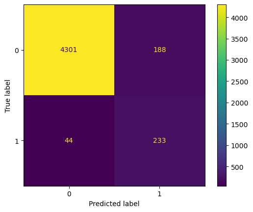

# DSI - Project 

# Car sales forecasting - ML Team 3 

## Table of Contents

1. [Team Members](#team-members)
2. [Business Problem and Objective](#business-problem-and-objective)
3. [Note About the Dataset](#note-about-the-dataset)
4. [Synthetic Additions](#synthetic-additions)
5. [Methodology](#methodology)
    - [Data Preparation](#data-preparation)
    - [Model Selection](#model-selection)
    - [Model Training and Evaluation](#model-training-and-evaluation)
6. [Key Findings](#key-findings)
7. [Visualization and Observation](#visualization-and-observation)
8. [Conclusion](#conclusion)

## Team members: 

- [Artem Kostiuk](https://github.com/postatum) ([video](https://youtu.be/10K-kLKbUek))
- [Julio Socher](https://github.com/juliosocher) ([video](https://www.loom.com/share/951764f8f44f42a8b56aaf4fe1f4a569))
- [Palash Bose](https://github.com/pala2003) ([video](https://www.loom.com/share/3b374e0a7cb94456a7008cbdb84b5f77))
- [Sakibal Sadat](https://github.com/ssadat92) ([video](https://www.loom.com/share/da1101a3f0464524ae40757e5093c7c6?sid=df905d06-7ffc-4fb3-ac94-1a8e4d491699))
- [Victor Lopez](https://github.com/vhlopezch)
- [Zoe Ackah](https://github.com/zoeackah)

## Business Problem and Objective 
#MLTeam3 is a market leading research group focused on automotive supply chain with data backed reporting and forecasting services for auto manufacturers, parts suppliers and dealership groups across the globe. #MLTeam3 provides AI backed market predictions and forecasts to optimize demand based decision making for all vehicles in the industry. 

### Business Problem
A large dealership network is seeking to optimize their sales forecast and engaged #MLTeam3 to boost their inventory management by identifying best selling vehicles within their competitve markets. 

### Objective
#MLTeam3 will develop a Machine Learning model to predict the top 3 best sellers and aid the dealer's inventory decisions to ensure model availability for customers to purchase with the aim of increasing sales volume and driving profitability. Target variable for the machine learning model is binary classification of "best seller" - whether a car will be a best seller in a particular month based on the car's features and historical sales data. Car dealers will be able to use the model to make predictions about best sellers to adjust inventory.

### Risks and unknowns
Some of the risks we have identified are:
* We have a limited amount of data - only ~28 thousand rows and 2 years of data - which limits our ability to well-tune a model. This will result in a sub-optimal model which will be prone to making mistakes;
* Technological limitations (e.g. slow machines) may prevent us from choosing the best classification model, because training such a model would either be impossible or take hours. This will results is us choosing a simpler model that is realistic to train using our technological resources.
 
## Note about the dataset
#MLTeam3 is leveraging the Car Sales Report data from Kaggle for training and testing the ML model. The base dataset contains sales data with over 20000 samples within 16 features. The dataset contains historical sales data for period of 24 months starting from Jan 1, 2022 and concluding by Dec 2023. The key features in the data are:

- Car_ID - A unique identifier for each car 
- Date - Date of the sale transaction 
- Customer Name - Name of the purchaser
- Gender - Gender of the purchaser
- Annual Income - Declared income of the purchaser
- Dealer Name - Name of the sales dealer
- Dealer No - Dealer id  
- Company - Brand/make of the car
- Model - Vehicle model 
- Engine - Engine specification 
- Transmission - Transmission of the vehicle 
- Color - Paint characteristics
- Body Style - Type of vehicle 
- Phone - Phone number of the purchaser
- Dealer Region - Geographic region of the dealer 

You can find the original dataset on Kaggle here: [Car Sales Report Dataset](https://www.kaggle.com/datasets/missionjee/car-sales-report/data)

## Synthetic Additions
To enhance the predictive power and real-world relevance of our dataset, we have introduced synthetic features that simulate critical variables often considered by consumers in the vehicle purchasing process. These additions aim to supplement the original data with practical and human-centered context.

- Family Size
Reflects the number of people in the purchaser’s household. This is a key factor influencing the type of vehicle chosen (e.g., sedan vs. SUV). Estimated based on vehicle category and type. For example, larger vehicles like SUVs and minivans are assigned larger family sizes, while compact cars typically serve smaller households or individuals. This variable simulates one of the key factors in buyer decision-making.

- Gas Mileage
Represents the distance the vehicle has been driven so far, one of the most important criteria for buyers when selecting a car. Assigned in relation to the vehicle’s brand, type, and price, we have determined a arbitrary start point and generated a random number based on that start point using a random function.

- Crash Test Score
Indicates the vehicle’s safety rating, typically based on standardized crash testing. Safety is also a major component in purchase decisions. Generated within a realistic range based on assumed safety performance, based on the type of brand - which was split between luxury and safe brands and also using the price in order to randomly generate a classification. Note: This does not reflect the real crash test score of those vehicles and it can be improved by extracting real data from the government departments in charge of this measure.

These synthetic enhancements were designed to align the dataset more closely with real-world buyer behavior, ultimately improving the performance and explainability of downstream forecasting models but are not trying to get a 100% accuracy to the data as all those synthetic data is randomly created based on values assigned by the group.

## Methodology
### Data Preparation 
#### Exploratory Data Analysis (EDA) – Vehicle Sales Dataset

This section of notebook (`02_eda_analysis`) performs exploratory data analysis (EDA) on the processed vehicle sales dataset to prepare it for machine learning model training.

**Objectives:**
- Clean and transform raw features
- Analyze data distributions and identify patterns
- Detect outliers or low-value features
- Identify relevant variables for modeling
- Summarize actionable insights to inform feature selection

**Key Steps:**

1. **Data Loading & Cleaning**
   - Loads the processed dataset from `../data/processed/car_sales_data_with_synthetic_features.csv`
   - Drops unnecessary columns (`Customer Name`, `Phone`, `Car_id`)
   - Normalizes and renames feature columns for consistency
   - Removes encoding artifacts (e.g., stray characters in the `engine` column)

2. **Feature Engineering**
   - Converts date columns to datetime and extracts `year` and `month`
   - Creates a combined `brand_model` feature
   - Converts categorical columns to the `category` dtype using configuration from `properties/all_categorical_features.yaml`
   - Bins annual income into groups for analysis

3. **Data Visualization**
   - Plots distributions for key numerical and categorical features
   - Analyzes monthly trends in vehicle price and customer income
   - Examines frequency of brand-model combinations
   - Computes and visualizes the correlation matrix for numerical features

4. **Insights & Feature Selection**
   - Summarizes key findings from the EDA
   - Selects features for model training based on data analysis and correlation

5. **Exporting Model-Ready Data**
   - Loads selected feature lists from `properties/selected_features.yaml`
   - Filters the DataFrame to include only selected features
   - Saves the model-ready dataset to `../data/processed/vehicle_sales_model_ready.parquet` in Parquet format for efficient downstream use

**Output:** Model-ready dataset saved to `../data/processed/vehicle_sales_model_ready.parquet`

**Requirements:** `pandas`, `matplotlib`, `seaborn`, `pyarrow`, `pyyaml`

#### Data Augmentation and Label Creation
During data preparation we also augmented data to introduce the actual label we want to predict and more features to have more accurate predictions. In particular:
1. To add a label/class of "best seller" we aggregated the data by month, year, car model, calculated number of each car model sales within a period and labeled models with top 3 sales as "best sellers". Rest of the car models within each period were marked as non "best sellers";
2. To have more features we introduced `last_N_months_sales` with N ranging from 1 to 12, where each feature represents number of sales of a particular car model in the last N month. This allowed us to include historical sales data and trends in the model training.

### Model selection 
Considering we are trying to solve a classification problem, we considered the following classification models:
* LogisticRegression;
* RandomForestClassifier;
* XGBClassifier;
* LGBMClassifier;

The reason we chose these particular models is - they were easy to understand, had a variety of hyperparameters to tune and our compute resources were enough to train them in a reasonable time.

### Model Training and Evaluation 

All the models we were working with were trained and evaluated in a similar manner.

First we split all the features we had into numeric and categorical to apply distinct processing to each category down the line. In particular we had:
* numeric features, e.g. year, month, number of sales in a current month, number of sales in previous 1-12 months;
* categorical features, e.g. engine type, transmission type, color, body style.

During data exploration and augmentation we noticed a imbalance in the data - non-best-sellers class was present in about 93% of the data, while best-seller only in around 7%. To address the issue and make sure models consider the imbalance, we calculated weights of the classes using sklearn tools and used them when training all the models.

To train the models we split available data into training and test sets by choosing the last 3 month of available data to be test data. This made sure model evaluation represented a real world scenario - model predicting future events based on past data.

Then we developed reusable functions to perform grid search of a model and evaluate a model. These functions accept parameters so they can be used to tune and evaluate every model in a similar manner.

The function that performs grid search uses the same one-hot encoding hyperparameters for all the models, allows to specify more hyperparameters to tune, prints some metrics and returns a best-performing model. It also aims to maximize F1 score, because this metric represents a balance of precision and recall.

The function that evaluates a model performance, predicts classes using test dataset, compares them to actual classes and outputs a few metrics, such as: accuracy, precision, recall, F1 score, AUC and a confusion matrix. The matrix played a crucial role in our model selection process, because it allowed us to choose a model that satisfied business requirements the best. Here's an example of what it looks like:

Next we configured a preprocessor pipeline, which is used by all the model. The pipeline does two things:
1. Performs standard scaling of numeric features to make sure they all contribute equally to the model performance. We had to do this, because some of our features have very different scale;
2. Performs One-Hot encoding of categorical features.

Then we created pipelines using each type of classifier we previously selected and the preprocessor we developed previously. Next, for each model we ran grid search using a variety of hyperparameters and evaluated the results. Again, we were aiming for maximizing F1 score and a confusion matrix with the least confusion.

Based on the evaluation we chose model using LGBMClassifier and exported it into a pickle file so it can be loaded and reused down the line. The output model had the following performance metrics:

    * Accuracy: 0.95132186319765
    * Precision: 0.5534441805225653
    * Recall: 0.8411552346570397
    * F1 Score: 0.667621776504298
    * AUC: 0.9706575158047791

## Key Findings 
Building upon the initial ML model results, our team conducted additional analysis to provide enhanced business insights for inventory planning. Through comprehensive evaluation, we identified several key findings:
Model Performance Analysis
The LGBMClassifier achieved strong overall metrics with 95% accuracy and high recall (84%), demonstrating effective identification of potential best sellers. However, deeper analysis revealed interesting patterns in model behavior across different vehicle brands:

Brand-Specific Performance Variability: Individual model accuracy ranged from 0% to 100% across different brands, indicating the binary classification approach may be sensitive to brand-specific sales patterns.
Seasonal Pattern Recognition: The model showed varying confidence levels throughout different months, suggesting seasonal factors significantly impact predictions.
Volume-Confidence Relationship: Further investigation revealed opportunities to enhance business actionability by incorporating volume forecasting alongside probability scoring.

Business Challenge: The "Borderline Brand" Phenomenon
Our analysis identified that certain high-volume brands (such as Volkswagen-Passat, ranking 4th in annual sales) experience monthly fluctuations in and out of the top 3, creating a "borderline brand" challenge for binary classification. This finding highlighted the need for complementary forecasting approaches to provide more nuanced business guidance.
Enhanced Methodology Development
To address these findings and provide additional business value, we developed a supplementary Linear Regression approach

## Visualization and Observation 

## Conclusion 
Conclusion
#MLTeam3 successfully delivered a comprehensive forecasting solution that addresses the dealership network's inventory optimization requirements through a multi-methodology approach.
Primary Deliverables Achieved

The machine learning model successfully identified monthly top 3 best sellers with strong performance metrics (95% accuracy, 84% recall), fulfilling the core business objective. Our analysis revealed that combining ML classification with linear regression forecasting delivers superior business actionability by providing both automated predictions and precise volume recommendations.
Strategic Implementation

Immediate Deployment: The ML model is production-ready for identifying top 3 monthly performers across the dealership network.

Enhanced Planning: The supplementary linear regression methodology provides volume-specific guidance for procurement teams, enabling precise inventory allocation and reducing both stockout and overstock risks.

Business Impact
This forecasting solution directly supports the dealership network's core objectives:

Increased Sales Volume: Accurate identification of high-demand models ensures product availability.

Improved Profitability: Optimized inventory levels reduce carrying costs while maximizing revenue opportunities.

Enhanced Customer Satisfaction: Reliable stock availability of top-performing models improves customer experience.

#MLTeam3 has delivered a scalable, data-driven solution that transforms automotive inventory management from reactive to predictive, positioning the dealership network for sustained market leader
